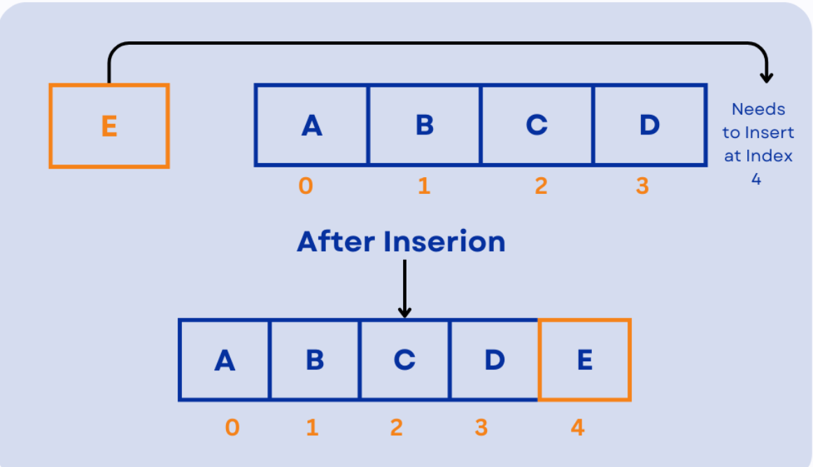

# Array Abstract Data Type (Array ADT)
An Array Abstract Data Type (ADT) is a logical model for an ordered collection of homogeneous elements, defining operations to access, modify, insert, and delete data using integer indices. It abstracts away implementation details, focusing on functionality like get(index) and set(index, value) rather than how memory is allocated.

## Creating an Array ADT

In this lesson, we will create an **Array ADT** that encapsulates common array operations, making them simple and accessible through a clean interface defined in the **array.h** class.

### Why Build an Array ADT?

Once our Array ADT is complete, operations like sorting become much simpler and more intuitive.

**Before (Traditional C++ approach):**
```cpp
void bubbleSort(int arr[], int n) {
    for (int i = 0; i < n - 1; ++i) {
        for (int j = 0; j < n - i - 1; ++j) {
            if (arr[j] > arr[j + 1]) {
                std::swap(arr[j], arr[j + 1]);
            }
        }
    }
}
```

**After (Using Array ADT):**
```cpp
array.sort();
```

This approach is similar to Python's elegant syntax:
```python
list.sort()
```

### What We'll Build

We will implement the underlying functionality for operations like `sort()`, `search()`, `insert()`, and `delete()` within our Array ADT, providing a clean, reusable interface for array manipulation.


# Coding Array ADT Functions

In this section, we will use **C++ Templates** to create a generic Array ADT that works with any data type, not just a fixed one.

### Supported Data Types

Our templated Array ADT will support:

- `int`
- `float`
- `char`
- `string`
- Any user-defined data types (classes/structs)

### What are Templates in C++?

**A C++ template is a powerful feature that enables us to write generic classes or functions. This allows us to create code that works with any data type without rewriting it for each specific type.**

Templates provide **type flexibility** and **code reusability**.

### Template Syntax

Here's how we implement templates in our Array ADT:
```cpp
template <typename T>
class ArrayADT {
private:
    T *arr;      // Pointer to array of type T
    int size;    // Maximum capacity
    int length;  // Current number of elements
};
```

**Key Points:**
- `template <typename T>` declares a template with type parameter `T`
- `T` is a placeholder that can be replaced with any data type
- When you see `T` in the code, think "any possible data type"

### Creating Instances
```cpp
ArrayADT<int> intArray(10);       // Array of integers
ArrayADT<string> strArray(5);     // Array of strings
ArrayADT<double> doubleArray(8);  // Array of doubles
```

The compiler generates appropriate code for each data type at compile time.


# Array ADT functions
### 0. Constructor of our Array ADT
As we know that Array ADT is fundamentally a class so it needs a constructor. In this constructor we will be doing the basic stuff like : 
- Making the dynamic array be ```new``` keyword 
- allocating size 
- initializing length to 0

This can be seen in the code below
```cpp
    ArrayADT(int size){
        this->size=size;
        this->length=0;
        arr=new int [size];
        cout<<"Array of size "<<size<<" created!"<<endl;
    }
```    

### 1. ```Array.append()```

This function is resposible for insertion of element in array depending upon what is stored in length(a variable that marks the size of filled array) .Also known as appending an element to an array.
```cpp
    void append(T element){
        arr[length]=element;
        length++;
    }

```


### Time Complexity : O(1)

Since we need to perform a two operations that are
- Insertion of the element in length position (end of array).
- Incrementing length by 1

so the number of steps are 
**f(n)=2** and Time Complexity is **O(1)**.

