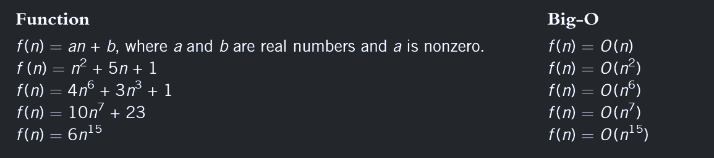

# The Concept of Number of Steps

**Definition:**
"Number of steps in an algorithm or code means the number of operations it performs."

Operations include:
- Arithmetic: addition, subtraction, multiplication, division
- Comparison: checking if values are equal, greater, or less
- Array operations: insertion, deletion, shifting
- Any computational operation the algorithm executes


```cpp
int sum = a + b;        // 1 operation (addition)
if(x > y)              // 1 operation (comparison)
    arr[i] = arr[i+1];  // 2 operations (array access + assignment)
```
1+1+2=5 operations / steps

The total number of steps tells us how much work the algorithm does.

**It is as simple as that.**

---
Consider following code snippets:

**Example 1:**
```cpp
cout << "Enter two numbers"; // Line 1: 1 operation (output)
cin >> num1 >> num2;         // Line 2: 2 operations (two inputs)
if (num1 >= num2)            // Line 3: 1 operation (comparison)
    max = num1;              // Line 4: 1 operation (assignment)
else                         // Line 5: 0 operations (just a keyword)
    max = num2;              // Line 6: 1 operation (assignment)
cout << max;                 // Line 7: 1 operation (output)
```


**Total operations = 1 + 2 + 1 + 1 + 1 = 6 operations**

In this algorithm, the number of operations is fixed regardless of input values.
This is an example of **O(1) - Constant Time Complexity**.

---
**Example 2:**
```cpp
#include <iostream>
using namespace std;

int main() {
    int num, count, sum;
    double average;

    cout << "Enter positive integers ending with -1" << endl; // Line 1
    count = 0;                                                // Line 2
    sum = 0;                                                  // Line 3
    cin >> num;                                               // Line 4

    while (num != -1) {                                       // Line 5
        sum = sum + num;                                      // Line 6
        count++;                                              // Line 7
        cin >> num;                                           // Line 8
    }

    cout << "The sum of the numbers is: " << sum << endl;    // Line 9

    if (count != 0) {                                        // Line 10
        average = static_cast<double>(sum) / count;          // Line 11
    } else {                                                  // Line 12
        average = 0;                                         // Line 13
    }

    cout << "The average is: " << average << endl;           // Line 14

    return 0;
}
```
This algorithm has five operations (Lines 1 through 4) before the while loop. Similarly, there are nine or eight operations after the while loop, depending on whether Line 11 or Line 13 executes.

Line 5 has one operation, and four operations within the while loop (Lines 6 through 8). Thus, Lines 5 through 8 have five operations. If the while loop executes 10 times, these five operations execute 10 times. One extra operation is also executed at Line 5 to terminate the loop. Therefore, the number of operations executed is 51 from Lines 5 through 8.

If the while loop executes 10 times, the total number of operations executed is:

10 × 5 + 1 + 5 + 9 or 10 × 5 + 1 + 5 + 8

That is,

10 × 5 + 15 or 10 × 5 + 14

lets take 10 × 5 + 14 for our analysis

We can generalize it to the case when the while loop executes n times. If the while loop executes n times, the number of operations executed is:

**5n + 14**

Buckle up for this:

### Rule 1 : The Big O ignores constants.

A **5n+14** or **5n+15** comes down to have a time complexity of **O(n)**.

**The main intention of Big O is to classify how the algorithm scale as the input grows , not keep track of number of steps.**

**O(100n) → O(n)**

**O(n²/2) → O(n²)**

**O(n + n/2) = O(1.5n) → O(n)**

**O(½n + ½n) → O(n)**

### Rule 2: Big O Only Keeps the Dominant Term

**"Big O ignores lower-order terms and keeps only the fastest-growing term."**

**Examples:**

- O(n² + n) → O(n²)
- O(n³ + n² + n + 1) → O(n³)
- O(n⁴ + n³ + n² + n) → O(n⁴)
- O(5n² + 100n + 500) → O(n²)

**Why?**

For large n, the highest-order term dominates completely:
- When n = 1000: n² = 1,000,000 but n = 1,000
- The n² term is 1000× larger, making n negligible

**Big O focuses on what matters at scale—the fastest-growing term.**

Big O classifies algorithms into different complexity classes
If two algorithms have the same Big O.

---
### **For the Math Lovers.**
### Formal Definition of Big O

**We say f(n) = O(g(n)) if:**

There exist positive constants **c** and **n₀** such that:
**f(n) ≤ c × g(n)** for all **n ≥ n₀**

### What This Means in Simple Terms:

- **f(n)** = your actual algorithm (the complicated function)
- **g(n)** = the simplified growth rate (like n, n², log n)
- **c** = some constant multiplier (like 2, 5, 100)
- **n₀** = the point after which this relationship holds true

**Translation:** 
After a certain input size (n₀), your algorithm f(n) will always be less than or equal to some constant (c) times the simple function g(n).

### Example:

If f(n) = 3n + 5:
- We can choose c = 4 and n₀ = 5
- For all n ≥ 5: 3n + 5 ≤ 4n
- Therefore f(n) = O(n)

**The key point:** For large enough inputs, f(n) grows no faster than g(n) (ignoring constants).


# The Takeaway : Relationship between number of steps and Big Oh


where f(n) is number of steps and O is time complexity.


